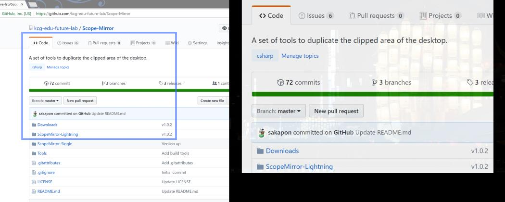

# Scope Mirror
A set of tools to duplicate the clipped area of the desktop.  
デスクトップの指定された領域を複製するためのツールのセットです。

See [documents on Wiki](https://github.com/kcg-edu-future-lab/Scope-Mirror/wiki).

## Single
For standalone, shows the desktop to a secondary display.  
デスクトップをセカンド ディスプレイに表示します。スタンドアロンで利用します。

### Setup
- [Download the app](https://github.com/kcg-edu-future-lab/Scope-Mirror/raw/master/Downloads/ClipMirror.Single-1.0.1.zip)

### Usage
- Execute `ClipMirror.Single.exe`

### System Requirements
- .NET Framework 4.5

### Release Notes
- **v1.0.1** The first release.

## Lightning
Shows the desktop to a remote computer on network.  
デスクトップをネットワーク経由で別のコンピューターに表示します。

### Setup
- [Download the app for a host computer](https://github.com/kcg-edu-future-lab/Scope-Mirror/raw/master/Downloads/ScopeMirror.Lightning.Host-1.0.1.zip)
- [Download the app for guest computers](https://github.com/kcg-edu-future-lab/Scope-Mirror/raw/master/Downloads/ScopeMirror.Lightning.Guest-1.0.2.zip)

### Usage
- Execute `ScopeMirror.Lightning.Host.exe`, on a host computer
- Edit `ScopeMirror.Lightning.Guest.exe.config` and set the IP address of the host computer
- Execute `ScopeMirror.Lightning.Guest.exe`, on guest computers

### System Requirements
- .NET Framework 4.5

### Release Notes
- **v1.0.1** The first release.
- **v1.0.2** Reduce big images.

## Future Plans
- `Multiple`: Shows the desktops of multiple computers simultaneously.  
複数のコンピューターのデスクトップを同時に表示します。
- For macOS.  
macOS 版。
